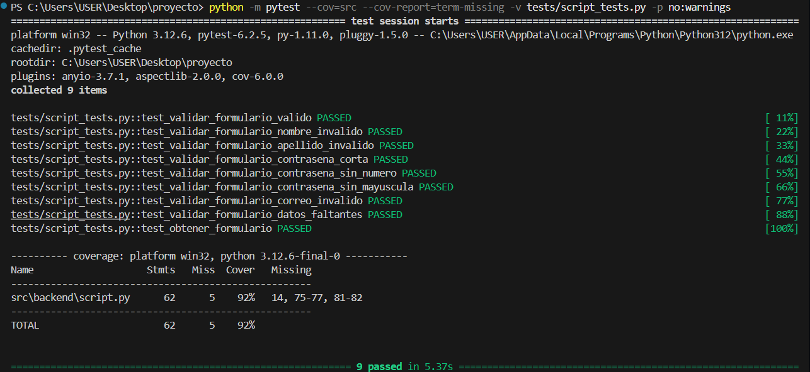

## Proyecto de Validación de Formulario con FastAPI

Este proyecto implementa una API para la validación de formularios utilizando **FastAPI** y **Pydantic**. Además, incluye pruebas con **pytest** para validar la funcionalidad y medir la cobertura del código.

---

### **Requisitos**
- Python 3.9 o superior
- Virtualenv (opcional pero recomendado)

---

### **Instrucciones de instalación y ejecución**

#### **1. Clonar el repositorio**
Clona este repositorio en tu máquina local:
```bash
git clone https://github.com/David29032003/PC4
cd proyecto
```

#### **2. Crear y activar un entorno virtual (opcional)**
Crea un entorno virtual para instalar las dependencias del proyecto:
```bash
python -m venv .venv
```

Activa el entorno virtual:
- En Windows:
  ```bash
  .venv\Scripts\activate
  ```
- En macOS/Linux:
  ```bash
  source .venv/bin/activate
  ```

#### **3. Instalar dependencias**
Instala todas las dependencias necesarias para el proyecto:
```bash
pip install -r requirements.txt
```

#### **4. Ejecutar el servidor**
Ejecuta el servidor con `script.py` en un terminal:
```bash
python src/backend/script.py 
```
El servidor estará disponible en: **http://127.0.0.1:8000**

---

### **Pruebas**

#### **1. Abrir un segundo terminal**
Mientras el servidor está en ejecución, abre un segundo terminal para correr las pruebas.

#### **2. Ejecutar las pruebas con cobertura**
Ejecuta el siguiente comando para ejecutar las pruebas y medir la cobertura del código:
```bash
python -m pytest --cov=src --cov-report=term-missing -v tests/test_script.py -p no:warnings
```

- `--cov=src`: Analiza la cobertura del código en la carpeta `src`.
- `--cov-report=term-missing`: Muestra las líneas de código no cubiertas por las pruebas.
- `-v`: Muestra detalles de cada prueba.
- `-p no:warnings`: Suprime las advertencias.

---

### **Estructura del proyecto**
```plaintext
proyecto/
├── .venv/               # Entorno virtual (opcional)
├── src/
│   ├── __init__.py      # Archivo necesario para reconocer src como paquete
│   ├── script.py        # Código principal del proyecto
├── tests/
│   ├── script_tests.py   # Pruebas unitarias del proyecto
├── requirements.txt     # Dependencias del proyecto
├── README.md            # Instrucciones del proyecto
```

---

### **Resultado esperado de las pruebas**
Si todo funciona correctamente, deberías ver algo como esto:



### **Notas**
- Si deseamos generar un reporte en HTML de la cobertura, se ejecuta:
  ```bash
  python -m pytest --cov=src --cov-report=html -v tests/test_script.py -p no:warnings
  ```
  Luego, abre `htmlcov/index.html` en un navegador.


